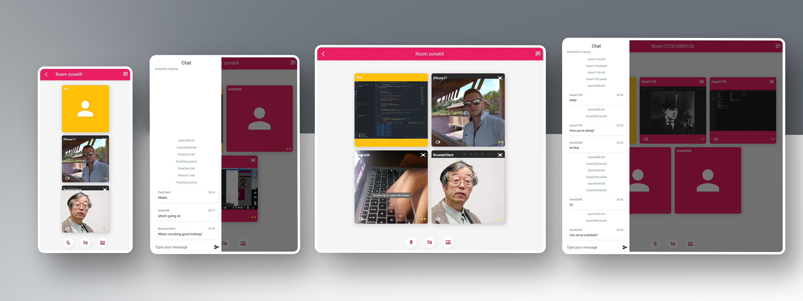

  

<h1 align="center">
  ASV Client
</h1>
<h6 align="center">
  Absolutely secure video chat
</h6>

  

### About
**Absolutely secure video chat** is an pure Web-RTC-based video conferencing and messaging application. The main feature is that it is completely anonymous, free and does't store any data on the server side.

### Things to notice
- Custom routing using Navigator 2.0 with url encoding and deep linking.
- Custom dependency injection
- Custom state management using ChangeNotifier with InheritedWidget
- Custom WebRTC signaling server based on Node.js typescript and socket.io.
- Bi-directional multi-peer video/audio communication.
- Solid connection handling with Unified Plan SDP, connection recovery and modern ICE candidates negotiation.
- Unique WebRTC implementation without any libs, no spagetti or 1000+ lines of crap even for above mentioned features.

### Signaling server part
[asv_room_service](https://github.com/digiboridev/asv_room_service)

### Try it out
[ASV Client web client](https://asv-client.onrender.com/)

